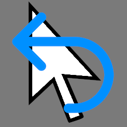

#  Godot Selection Undo

Add selection to the undo stack in Godot Editor

It's just a quick and dirty implementation. For now, it works pretty well for me but it's probably not production ready.

See Godot Proposal [#2958](https://github.com/godotengine/godot-proposals/issues/2958)
